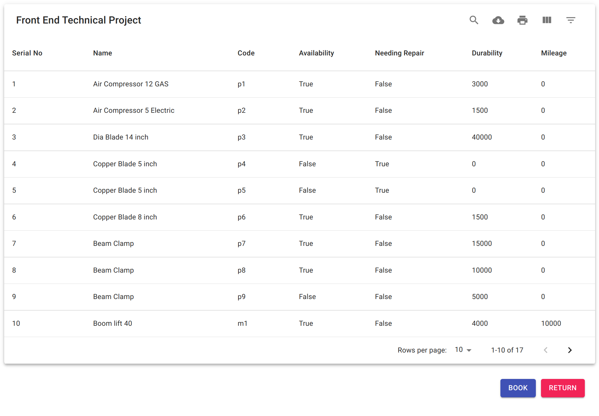
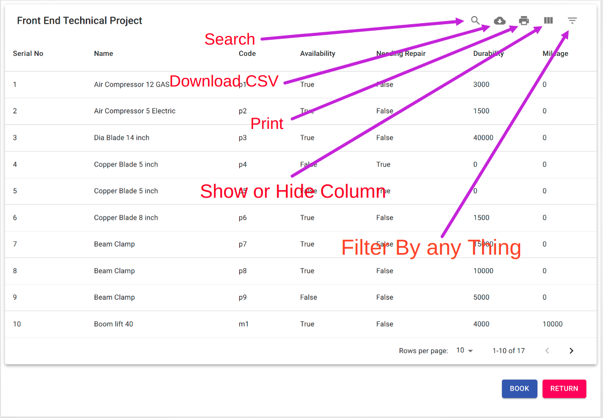
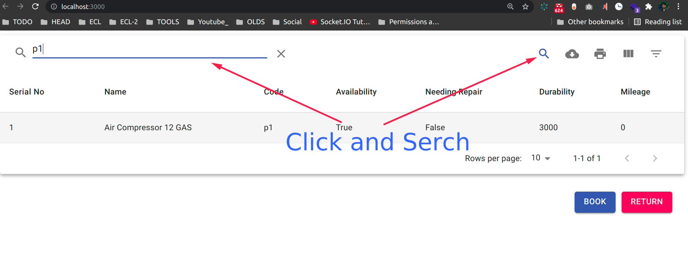
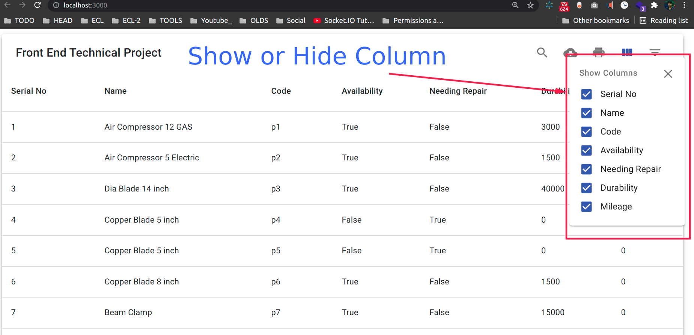
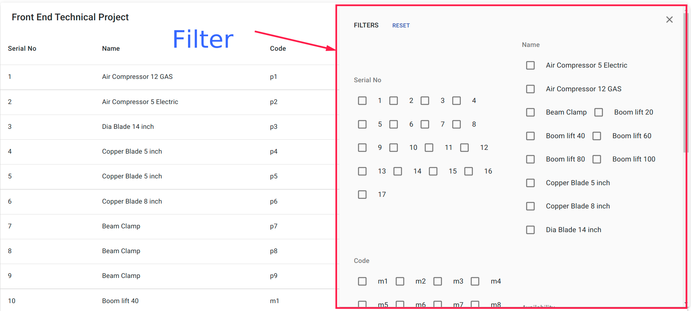
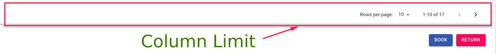
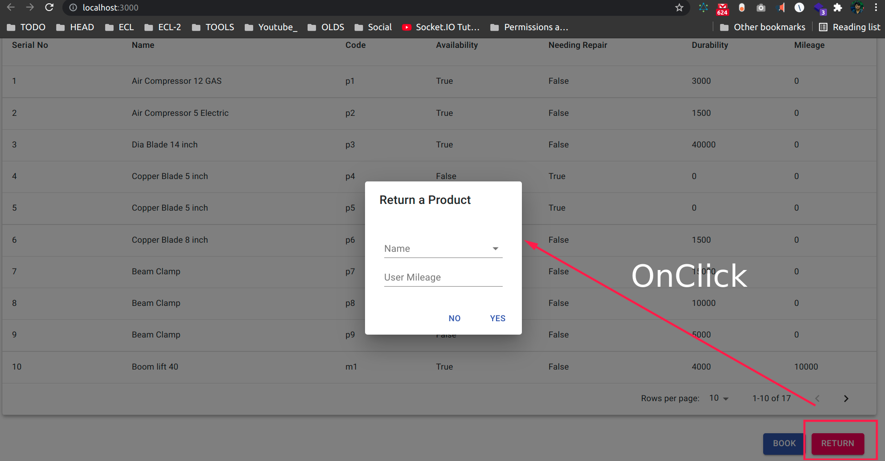
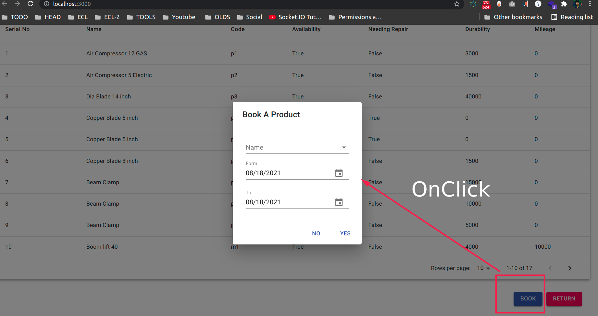

# [Md Rafiqul Islam](https://codewithrafiq.github.io/)
# [My Youtube Chanels](https://www.youtube.com/c/CodeWithRafiq)


## For Running this Project On Your Local Machine
```
git clone 

cd 

npm i

npm start
```

## Full Page


## All Actions



## Search



## Show or Hide Columns



## Filter By Any Fields



## On Footer We can Limite Columns 



## Click On Return Button



## Click On Book Button


